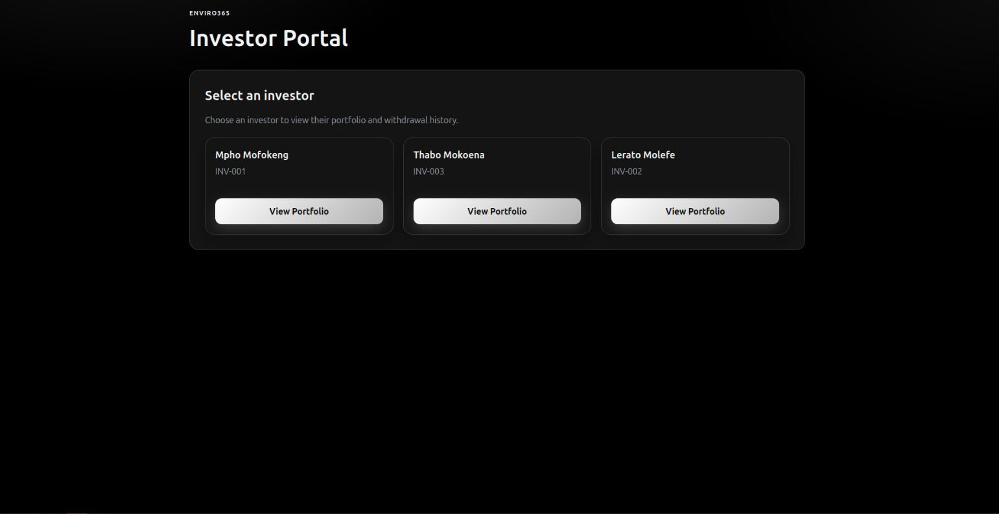
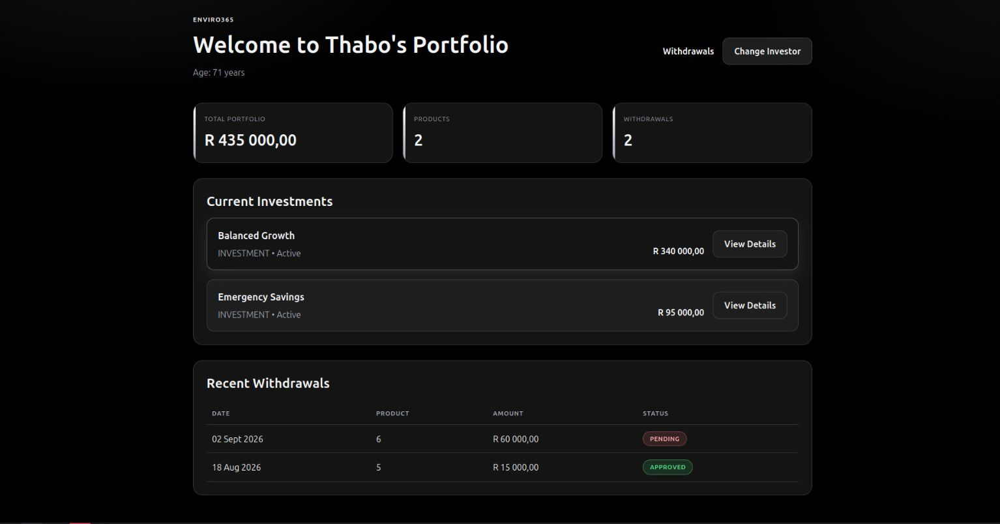
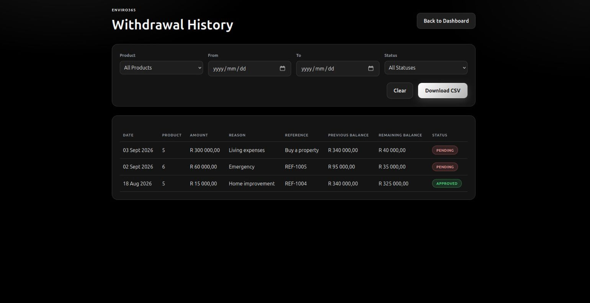
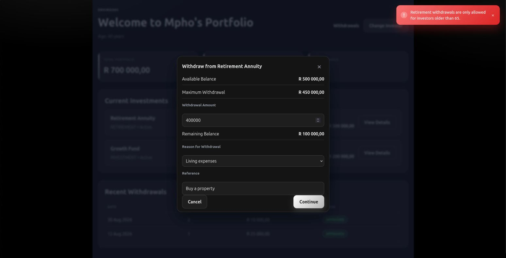

# Enviro365 Investor Withdrawal System

## Project overview

The Enviro365 Investor Withdrawal System is a full-stack application that allows a user to select an investor, review their portfolio, submit a withdrawal request, and inspect historical withdrawal notices. The project demonstrates a practical business flow for financial services: validating ownership, checking balances and eligibility, recording a withdrawal notice, and exporting the history as CSV.

This repository contains both the backend API and the frontend portal. The backend is built with Java 21 and Spring Boot, while the frontend uses React and Vite. Together they provide a local, in-memory demonstration of an investor withdrawal workflow.

## Business problem

Investors can hold multiple investment products, and each product has a current balance. Withdrawals must be validated carefully to avoid invalid transactions. The system needs to protect the business from unsupported requests such as withdrawals that:

- exceed the product balance,
- exceed the 90% maximum allowed withdrawal threshold,
- target the wrong investor or product combination,
- violate retirement-only eligibility rules,
- or submit a non-positive amount.

The application solves this by centralizing validation in the backend and presenting clear, user-friendly errors in the frontend.

## Features

- Investor directory with selectable investor records
- Portfolio summary showing balances and product details
- Withdrawal request validation for amount, balance, product ownership, and retirement rules
- Max-withdrawal rule set to 90% of the available balance
- Frontend confirmation flow before submitting a withdrawal
- Withdrawal history with timestamped records and status tracking
- Status filters and CSV export for withdrawal history
- Seeded H2 data for local testing and demonstration

## Project structure

The repository is organized into a small monorepo with a backend API, a frontend application, and supporting documentation.

```text
backend/
├── src/
│   ├── main/
│   │   ├── java/
│   │   │   └── com/enviro/assessment/junior/mpho/
│   │   │       ├── controller/
│   │   │       ├── dto/
│   │   │       ├── entity/
│   │   │       ├── exception/
│   │   │       ├── repository/
│   │   │       └── service/
│   │   └── resources/
│   │       ├── application.properties
│   │       └── data.sql
│   └── test/java/
│       └── com/enviro/assessment/junior/mpho/
├── pom.xml
└── target/

frontend/
├── src/
│   ├── App.jsx
│   ├── main.jsx
│   └── styles.css
├── index.html
├── package.json
├── vite.config.js
└── dist/

docs/
├── AI_Usage.md
├── api-specification.md
├── business-rules.md
├── database-design.md
├── screenshots/
│   ├── investor-directory.svg
│   └── withdrawal-history.svg

Makefile
README.md
```

## Documentation

- [AI Usage](docs/AI_Usage.md): Development approach and responsible AI assistance.
- [API Specification](docs/api-specification.md): Endpoints, request and response contracts, and error responses.
- [Business Rules](docs/business-rules.md): Withdrawal validation and eligibility rules.
- [Database Design](docs/database-design.md): Data model and persistence design.

### Key folders

- backend: Spring Boot application, business logic, persistence layer, and tests
- frontend: React/Vite UI for investor selection, portfolio viewing, withdrawals, and history
- docs: AI usage disclosure, design notes, rules, API docs, and screenshots
- root: project-level setup and shared commands through the Makefile

### Typical backend packages

- controller: REST endpoints for investors and withdrawals
- dto: request and response models
- entity: domain models and persistence entities
- exception: custom exceptions and global API error handling
- repository: JPA data access interfaces
- service: core withdrawal validation and processing logic

## Technology stack

- Java 21
- Spring Boot 3.4.4
- Spring Web
- Spring Data JPA
- Bean Validation
- H2 in-memory database
- React 18
- Vite
- Axios
- React Router
- Maven
- npm

## Prerequisites

Before running the project, ensure you have the following installed:

- Java 21 or later
- Maven
- Node.js 18+ and npm
- GNU Make (optional, but used by the provided shortcut commands)

## Setup instructions

1. Clone the repository.
2. Open a terminal in the project root.
3. Install the frontend dependencies:

```bash
make install
```

If you do not use Make, run:

```bash
npm --prefix frontend install
```

## How to run backend

Start the backend API from the project root:

```bash
make backend-run
```

Or run directly with Maven:

```bash
mvn -f backend/pom.xml spring-boot:run
```

The API listens on:

- http://localhost:8080

## How to run frontend

Start the frontend in a separate terminal:

```bash
make frontend-run
```

Or run it directly:

```bash
npm --prefix frontend run dev -- --host 0.0.0.0 --port 5173
```

The frontend runs on:

- http://localhost:5173

Open the app in your browser and select an investor to continue to the portfolio dashboard.

## API overview

All API endpoints use the /api prefix.

| Method | Endpoint | Purpose |
| --- | --- | --- |
| GET | /api/investors | Return all investors |
| GET | /api/investors/{investorId}/portfolio | Return portfolio and product details |
| POST | /api/withdrawals | Create a withdrawal notice |
| GET | /api/investors/{investorId}/withdrawals | Return withdrawal history |
| GET | /api/investors/{investorId}/withdrawals/export | Download filtered withdrawal history as CSV |

### Example validation rules

- Withdrawal amount must be greater than zero
- Withdrawal cannot exceed available balance
- Withdrawal cannot exceed 90% of available balance
- Retirement withdrawals require the investor to be older than 65
- Investor and product must belong to the same portfolio

See [docs/api-specification.md](docs/api-specification.md) and [docs/business-rules.md](docs/business-rules.md) for the detailed request and response contracts and business rules. The development approach and responsible use of AI assistance are described in [docs/AI_Usage.md](docs/AI_Usage.md).

## Testing instructions

Run the backend test suite from the project root:

```bash
make test
```

This executes:

```bash
mvn -f backend/pom.xml test
```

The backend test suite validates the withdrawal rules and core business flows. The frontend currently does not include a dedicated automated test suite.

To build both backend and frontend together:

```bash
make build
```

To clean generated build output:

```bash
make clean
```

## Screenshots

The following mock screenshots represent the main user flows of the application:









## Assumptions

This project is intended as a local assessment/demo application. The following assumptions apply:

- Data is stored in an in-memory H2 database and resets when the backend restarts
- No authentication or authorization layer is implemented
- No real banking, payment processing, or external financial system integration is included
- The app is designed for local development and demonstration rather than production deployment
- Business rules are enforced server-side and mirrored in the UI for better usability

## Project structure

```text
backend/          Spring Boot application, JPA entities, repositories, services, and tests
frontend/         React + Vite user interface
docs/             AI usage disclosure, API specification, business rules, and database design
Makefile          Common development commands
README.md         Project overview and onboarding guide
```

## Author

Mpho Gift Mofokeng eTalent Junior Developer Assessment 2026
